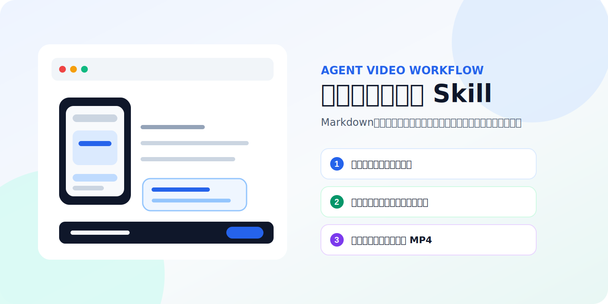
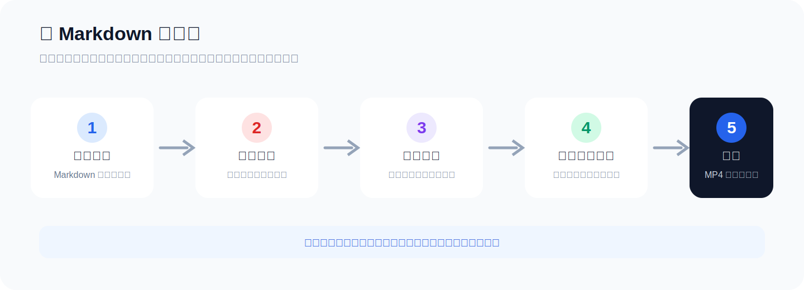
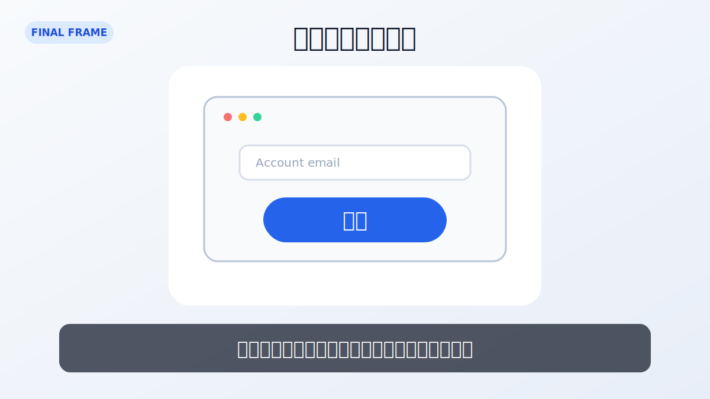
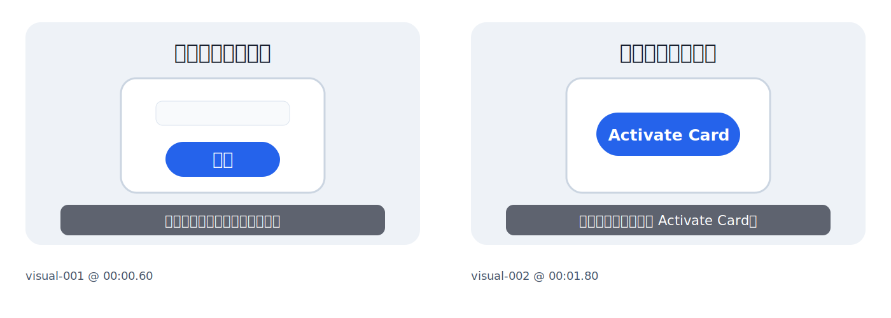
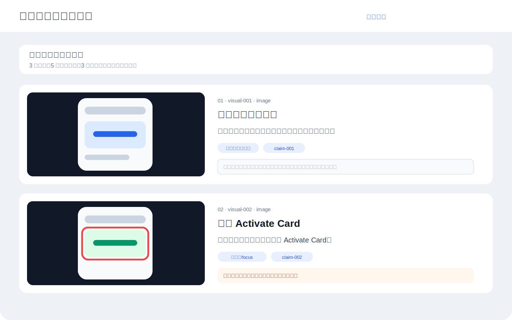
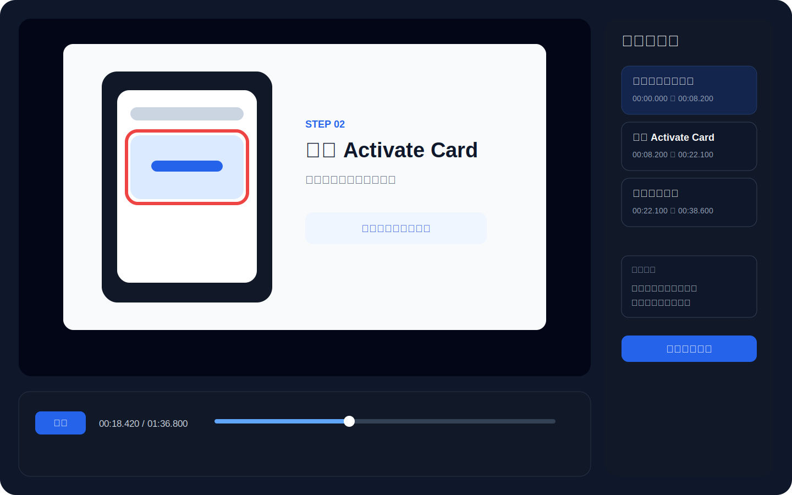

<p align="center">
  
</p>

<h1 align="center">Bank Card Tutorial Video Skill</h1>

<p align="center">
  将包含文字和图片的 Markdown 银行卡教程，处理为经过事实核验、隐私检查、真人感配音、字幕、分镜审核、时间线预览和最终验收的 MP4 成片。
</p>

<p align="center">
  <a href="https://github.com/TingYuNya/bank-card-tutorial-video-skill/actions/workflows/ci.yml"></a>
  
  
  
  
  
  <a href="LICENSE"></a>
</p>

<p align="center">
  <a href="#快速开始">快速开始</a> ·
  <a href="#真实输出示例">输出示例</a> ·
  <a href="#主要能力">能力</a> ·
  <a href="#事实核验规则">事实核验</a> ·
  <a href="#隐私检查规则">隐私检查</a> ·
  <a href="docs/ARCHITECTURE.md">架构</a> ·
  <a href="ROADMAP.md">路线图</a>
</p>

## 项目说明

这个 Skill 面向银行卡开卡、激活、绑卡、账单、还款和账户设置类视频教程。

输入内容是一份 Markdown 文档和本地图片。Agent 先整理文稿，核验银行卡相关陈述，逐张检查敏感信息，再生成配音稿、分镜、字幕和时间线。用户可以在浏览器审核分镜与整条视频节奏，确认后再导出最终 MP4。

项目适合以下内容：

1. 银行卡开卡与激活教程。
2. 信用卡或借记卡 App 操作演示。
3. 还款账户绑定、账单查看和自动还款设置。
4. 海外银行、数字银行和支付工具的图文教程。
5. 需要官方信源核验和隐私遮挡的金融操作视频。

<p align="center">
  
</p>

## 真实输出示例

下面的画面按仓库测试项目的实际渲染结构整理，使用虚构页面与测试数据，不包含真实银行卡或账户信息。

<p align="center">
  
</p>

质量检查会为每个场景抽取代表帧，并生成 contact sheet，便于一次查看字幕、构图、遮挡和场景切换。

<p align="center">
  
</p>

> 示例图只用于说明渲染链路。真实项目仍需人工确认官方页面、事实核验日期、素材授权和隐私遮挡。

## 文档索引

| 文档 | 内容 |
| --- | --- |
| [`SKILL.md`](SKILL.md) | Agent 执行规则、强制校验和完整工作流 |
| [`docs/QUICKSTART.md`](docs/QUICKSTART.md) | 最小可运行安装与成片流程 |
| [`docs/ARCHITECTURE.md`](docs/ARCHITECTURE.md) | 数据流、组件边界和确定性渲染设计 |
| [`docs/PRIVACY-AND-COMPLIANCE.md`](docs/PRIVACY-AND-COMPLIANCE.md) | 金融素材脱敏、第三方服务和发布前检查 |
| [`docs/LICENSE-AND-ATTRIBUTION.md`](docs/LICENSE-AND-ATTRIBUTION.md) | Apache 2.0、上游来源和第三方权利说明 |
| [`DISCLAIMER.md`](DISCLAIMER.md) | 金融信息、自动核验和第三方服务边界 |
| [`SECURITY.md`](SECURITY.md) | 漏洞与敏感信息报告方式 |
| [`SUPPORT.md`](SUPPORT.md) | 支持范围、提问要求和问题分类 |
| [`CONTRIBUTING.md`](CONTRIBUTING.md) | 开发环境、兼容性要求和提交规范 |
| [`CODE_OF_CONDUCT.md`](CODE_OF_CONDUCT.md) | 社区协作行为准则 |
| [`CHANGELOG.md`](CHANGELOG.md) | 版本变更记录 |
| [`ROADMAP.md`](ROADMAP.md) | 近期计划与明确不纳入范围 |
| [`CITATION.cff`](CITATION.cff) | 仓库引用元数据 |

## 主要能力

| 模块 | 处理内容 |
| --- | --- |
| Markdown 解析 | 读取标题、正文、列表和本地图片引用，整理为结构化章节 |
| 文稿优化 | 调整叙述顺序，补齐前置条件、适用范围和容易遗漏的操作说明 |
| 事实核验 | 对费率、资格、押金、额度、还款、退款和卡组织权益逐条记录来源 |
| 隐私检查 | 检查卡号、CVV、有效期、验证码、账户号、地址、余额和交易记录 |
| 配音 | 支持 ElevenLabs、OpenAI TTS 和 Azure Speech，按场景缓存音频 |
| 字幕 | 输出 SRT、ASS 和 JSON，保留英文按钮名、卡名和数字的完整性 |
| 分镜 | 将每段口播绑定到图片、截图、信息卡、标注和官方来源 |
| 审核页面 | 提供分镜审核页与可拖动、可倍速播放的时间线预览 |
| 视频渲染 | 使用 Playwright 恢复确定性画面状态，再用 FFmpeg 编码 MP4 |
| 成片验收 | 使用 ffprobe、逐场景抽帧、contact sheet、黑帧和静音检测检查结果 |

### 配音提供商能力对照

| 提供商 | 中文配音 | 时间戳来源 | 适合场景 | 备注 |
| --- | --- | --- | --- | --- |
| ElevenLabs | 支持 | 字符级时间戳 | 追求自然停顿和较强真人感 | 需要 Voice ID |
| OpenAI TTS | 支持 | 可选 Whisper 词级对齐 | 希望统一使用 OpenAI API | 配音与对齐可能产生两次调用 |
| Azure Speech | 支持 | WordBoundary 事件 | 需要稳定的中文神经语音与区域化部署 | 需要 Speech Region |

所有提供商都按场景缓存音频。文本、声音、模型或关键参数发生变化时，对应场景会自动失效并重新生成。

## 审核页面

分镜页用于逐场景检查画面、口播、事实来源和隐私遮挡。每个场景可以单独通过或退回修改。

<p align="center">
  
</p>

时间线页用于检查整条视频的节奏。页面支持播放、暂停、拖动、倍速、音量调整和场景跳转。

<p align="center">
  
</p>

## 工作流

完整流程分为六个阶段。

### 1. 初始化项目

脚本读取 Markdown，复制本地图片，生成章节清单和素材清单。

### 2. 内容审校

Agent 生成以下文件：

```text
work/fact-check.json
work/privacy-review.json
work/revised-article.md
work/narration.json
work/on-screen-text.md
work/storyboard.json
sources/source-list.md
```

### 3. 分镜审核

浏览器显示每段口播对应的主画面、镜头动作、事实编号和隐私状态。用户确认分镜方向后，流程进入配音和时间线阶段。

### 4. 配音与字幕

每条口播独立生成音频并缓存。修改一个场景时，可以只重做该场景。字幕优先读取 TTS 提供商的时间戳，也可以使用 OpenAI Whisper 做词级对齐。

### 5. 时间线审核

Agent 合并音频、字幕、素材、标注、隐私遮挡和镜头动作。用户可以拖动时间轴检查任意时间点。

### 6. 渲染与验收

Playwright 按帧恢复播放器状态，FFmpeg 编码 H.264 和 AAC。导出完成后检查分辨率、帧率、时长、音轨、黑帧、静音和每个场景的关键帧。

## 环境要求

需要安装：

| 依赖 | 建议版本 | 用途 |
| --- | --- | --- |
| Python | 3.11 或更高 | 运行项目脚本 |
| FFmpeg | 较新的稳定版本 | 音视频处理和编码 |
| ffprobe | 随 FFmpeg 安装 | 成片信息检查 |
| Chromium | Playwright 管理 | HTML 时间线逐帧渲染 |
| Git | 任意近期版本 | 安装和更新 Skill |

Python 依赖位于 `requirements.txt`。

## 安装

### 安装到 Codex

```bash
git clone https://github.com/TingYuNya/bank-card-tutorial-video-skill.git
cp -R bank-card-tutorial-video-skill ~/.codex/skills/
cd ~/.codex/skills/bank-card-tutorial-video-skill
python -m pip install -r requirements.txt
python -m playwright install chromium
cp .env.example .env
python scripts/check_env.py
```

### 安装到 Claude Code

```bash
git clone https://github.com/TingYuNya/bank-card-tutorial-video-skill.git
cp -R bank-card-tutorial-video-skill ~/.claude/skills/
cd ~/.claude/skills/bank-card-tutorial-video-skill
python -m pip install -r requirements.txt
python -m playwright install chromium
cp .env.example .env
python scripts/check_env.py
```

### 原目录直接运行

也可以直接在克隆目录内运行脚本，无需复制到 Skill 目录。Codex 或 Claude Code 需要读取该目录中的 `SKILL.md`。

## 配置 TTS

在 `.env` 中配置任意一组提供商。

### ElevenLabs

```env
ELEVENLABS_API_KEY=your_api_key
ELEVENLABS_VOICE_ID=your_voice_id
```

优点包括中文自然度较高，接口可以返回字符级时间戳。默认模型配置为 `eleven_multilingual_v2`。

### OpenAI TTS

```env
OPENAI_API_KEY=your_api_key
```

默认模型配置为 `gpt-4o-mini-tts`，默认声音为 `marin`。需要更细字幕时间时，可以调用 `whisper-1` 做词级对齐。

### Azure Speech

```env
SPEECH_KEY=your_speech_key
SPEECH_REGION=your_region
```

默认声音配置为 `zh-CN-XiaoxiaoNeural`，脚本读取 `WordBoundary` 事件生成词级时间。

API Key 只保存在本地 `.env`。`.gitignore` 已排除该文件。

## 输入格式

推荐目录结构：

```text
input/
├── tutorial.md
└── images/
    ├── 01-login.png
    ├── 02-activate.png
    └── 03-payment.png
```

Markdown 使用相对路径引用图片：

```markdown
# 示例银行卡激活教程

## 登录账户

打开银行官方应用，使用已经注册的账户登录。


## 激活卡片

进入卡片管理页面，找到 Activate Card，并按照页面提示核对卡片信息。


```

远程图片不会自动下载。请先将图片保存到输入目录，以便后续复现渲染结果并确认素材授权。

## 快速开始

### 1. 初始化

```bash
python scripts/init_project.py \
  --input /absolute/path/to/input/tutorial.md \
  --project /absolute/path/to/project

python scripts/validate_project.py \
  --project /absolute/path/to/project \
  --phase initialized
```

### 2. 让 Agent 完成内容审校

可以给 Codex 或 Claude Code 使用下面的指令：

```text
使用 bank-card-tutorial-video:教程成片，读取这个项目里的 tutorial.md 和 images。
先整理文章结构，逐条核验银行卡相关陈述，并完成每张图片的隐私检查。
生成 revised-article.md、narration.json、fact-check.json、privacy-review.json 和 storyboard.json。
完成后生成分镜审核页，暂时不要导出最终视频。
```

内容阶段检查：

```bash
python scripts/validate_project.py \
  --project /absolute/path/to/project \
  --phase content
```

### 3. 生成分镜审核页

```bash
python scripts/build_review_pages.py \
  --project /absolute/path/to/project

python scripts/serve_preview.py \
  --project /absolute/path/to/project \
  --port 8767
```

浏览器打开：

```text
http://127.0.0.1:8767/review/storyboard-audit.html
```

审核结果保存到：

```text
work/storyboard-review.json
```

### 4. 生成配音、字幕和时间线

```bash
python scripts/generate_tts.py \
  --project /absolute/path/to/project \
  --provider elevenlabs \
  --reuse

python scripts/build_subtitles.py \
  --project /absolute/path/to/project

python scripts/build_timeline.py \
  --project /absolute/path/to/project
```

打开时间线：

```text
http://127.0.0.1:8767/review/timeline-preview.html
```

审核结果保存到：

```text
work/timeline-review.json
```

### 5. 渲染最终成片

```bash
python scripts/validate_project.py \
  --project /absolute/path/to/project \
  --phase render

python scripts/render_final_video.py \
  --project /absolute/path/to/project

python scripts/quality_check.py \
  --project /absolute/path/to/project
```

默认成片位置：

```text
renders/银行卡教程-final.mp4
```

## 项目输出

```text
project/
├── source/
│   ├── tutorial.original.md
│   └── assets/
├── work/
│   ├── sections.json
│   ├── manifest.json
│   ├── fact-check.json
│   ├── privacy-review.json
│   ├── revised-article.md
│   ├── narration.json
│   ├── on-screen-text.md
│   ├── storyboard.json
│   ├── audio-timeline.json
│   ├── subtitles.json
│   └── timeline.json
├── audio/
│   ├── scenes/
│   ├── narration.wav
│   └── timings.json
├── subtitles/
│   ├── subtitles.srt
│   └── subtitles.ass
├── review/
│   ├── storyboard-audit.html
│   └── timeline-preview.html
├── renders/
│   ├── final-player.html
│   ├── frames/
│   └── 银行卡教程-final.mp4
├── quality/
│   ├── frames/
│   ├── contact-sheet.jpg
│   └── quality-report.md
└── sources/
    └── source-list.md
```

## 事实核验规则

金融产品信息可能随地区、账户状态、申请渠道和时间变化。以下内容必须逐条核验：

1. 年费、月费、外汇手续费和 ATM 费用。
2. 押金金额、押金退还条件和信用额度关系。
3. 申请资格、身份要求、地区限制和信用检查方式。
4. 还款到账时间、可用余额恢复时间和自动还款规则。
5. 信用报告、额度调整、升级和产品转换说明。
6. 卡组织级别、权益、保险和合作活动。

默认接受的来源包括银行官网、卡组织官网、监管机构、产品协议、费率表、官方帮助中心和官方应用说明。

默认配置关闭中文来源。需要使用银行官方中文页面时，可以在项目配置中显式开启。

## 隐私检查规则

每张进入视频的图片都需要生成审核记录。重点检查：

1. 完整卡号、CVV、有效期和 PIN。
2. 短信验证码、邮件验证码和登录密码。
3. 银行账户号、routing number、IBAN 和客户编号。
4. 姓名、手机号、邮箱和详细地址。
5. 二维码、条形码、身份文件和 Session Token。
6. 余额、交易记录、信用额度和账单信息。

遮挡区域使用归一化坐标保存，便于在不同输出比例下复用。默认只允许展示卡号后四位。

## 配置说明

全局默认配置位于：

```text
config/default.json
```

项目目录中的 `project.json` 可以覆盖默认值。

支持的画面比例：

| 比例 | 默认逻辑画布 | 适用场景 |
| --- | --- | --- |
| 16:9 | 1920 × 1080 | B 站、YouTube、横屏教程 |
| 9:16 | 1080 × 1920 | 抖音、Reels、Shorts |
| 3:4 | 1080 × 1440，DPR 1.5 | 小红书和竖屏图文教程 |
| 4:3 | 1440 × 1080 | 传统演示和课程画面 |

配置还包括字幕字号、画面安全区、配音提供商、场景停顿、背景音乐音量、目标响度、帧率、CRF、编码预设和是否保留中间帧。

## 目录结构

```text
bank-card-tutorial-video-skill/
├── SKILL.md
├── README.md
├── config/
│   └── default.json
├── .github/
│   ├── workflows/ci.yml
│   ├── workflows/release-package.yml
│   ├── ISSUE_TEMPLATE/
│   └── pull_request_template.md
├── docs/
│   └── images/
├── examples/
├── references/
│   ├── artifact-contracts.md
│   ├── fact-check-contract.md
│   ├── privacy-contract.md
│   └── storyboard-schema.json
├── scripts/
│   ├── init_project.py
│   ├── validate_project.py
│   ├── generate_tts.py
│   ├── build_subtitles.py
│   ├── build_timeline.py
│   ├── build_review_pages.py
│   ├── serve_preview.py
│   ├── render_final_video.py
│   ├── quality_check.py
│   └── build_release.py
├── templates/
│   ├── storyboard-audit.html
│   ├── timeline-preview.html
│   └── final-player.html
├── tests/
│   └── test_core.py
├── requirements.txt
├── .env.example
├── TEST-REPORT.md
├── ROADMAP.md
├── CITATION.cff
├── NOTICE.md
└── LICENSE
```

## 常见问题

### 浏览器无法打开预览页

确认 `serve_preview.py` 正在运行，并通过 `http://127.0.0.1:8767` 打开页面。直接双击 HTML 文件时，浏览器会限制本地 JSON、音频和视频加载。

### 拖动时间线后音画不同步

确认预览页面使用项目自带的 Range 服务。普通静态服务器可能无法正确处理媒体随机读取。

### Playwright 找不到 Chromium

运行：

```bash
python -m playwright install chromium
```

系统已经有 Chromium 时，可以在渲染命令中传入：

```bash
--chrome-executable /path/to/chromium
```

### 字幕时间不够准确

ElevenLabs 可以直接返回字符级时间。Azure Speech 可以使用 `WordBoundary`。OpenAI TTS 场景可以配合 `whisper-1` 做词级对齐。

### 修改一段文稿后需要全部重做配音吗

使用 `--reuse`。脚本根据场景文本和配音参数计算缓存键，只重新生成发生变化的场景。

### 最终视频能直接公开发布吗

发布前仍需要人工查看事实核验记录、每张图片的隐私遮挡、时间线预览和质量报告。银行页面及产品规则会变化，成片发布日期也应记录核验日期。

## 使用边界

这个项目聚焦可审核、可复现的教程成片流程。以下任务目前不在主要范围内：

1. 代替人工判断银行条款、信用规则或法律结论。
2. 将真实银行卡、账单、证件或验证码自动上传到第三方服务。
3. 复杂多机位剪辑、专业调色、精细声音设计和 NLE 工程文件交付。
4. 未经分镜与时间线审核直接生成可公开发布的金融教程。
5. 自动登录银行账户、自动操作申请流程或自动提交金融表单。

计划方向见 [`ROADMAP.md`](ROADMAP.md)。

## 自动化检查

仓库的 GitHub Actions 会在 `main` 推送和 Pull Request 中执行：

1. Python 3.11 与 3.12 源码编译。
2. 核心解析、配置合并、路径安全和项目初始化单元测试。
3. JSON 文件解析检查。
4. README 使用的 SVG 素材格式检查。

这些检查不调用付费 TTS，也不会上传任何教程素材。完整成片测试仍需在装有 FFmpeg、Chromium 和本地 API Key 的环境执行。

## 当前测试状态

`TEST-REPORT.md` 记录了当前版本的测试范围。已完成的离线测试包括：

1. Python 脚本编译和环境检查。
2. Markdown 初始化、图片复制和项目校验。
3. TTS 场景缓存复用和音频拼接。
4. 中英混合字幕断句。
5. 时间线合并、Range 请求和审核结果写入。
6. Playwright 逐帧渲染和 FFmpeg 合成。
7. ffprobe、逐场景抽帧、contact sheet、黑帧检测和音轨检查。

真实 TTS 请求需要使用者自己的 API Key。语音质量、额度和费用由所选提供商决定。

## 安全与使用边界

1. 不要将 `.env`、真实银行卡截图、个人账单或最终未脱敏素材提交到仓库。
2. 示例素材应使用虚构数据或完成脱敏。
3. 本项目提供制作工作流，不提供银行、信用、法律或财务结论。
4. 银行页面、按钮和产品规则变化后，需要重新核验并更新教程。
5. 使用第三方 TTS 服务前，请确认素材、声音和数据处理方式符合当地法律及服务条款。

## 参与开发与发布

提交修改前请阅读 [`CONTRIBUTING.md`](CONTRIBUTING.md)。安全问题按 [`SECURITY.md`](SECURITY.md) 的私下报告方式处理，普通使用问题见 [`SUPPORT.md`](SUPPORT.md)。

建议本地执行：

```bash
python -m compileall -q scripts tests
python -m unittest discover -s tests -v
```

版本变更记录在 [`CHANGELOG.md`](CHANGELOG.md)，引用信息在 [`CITATION.cff`](CITATION.cff)。再分发或制作派生版本时，需要保留 `LICENSE`、`NOTICE.md` 和修改说明。

本地构建公开发行包：

```bash
python scripts/build_release.py
```

脚本会重建 `PACKAGE-MANIFEST.json`，生成 ZIP 和对应的 SHA-256 文件。推送 `v*` 标签后，GitHub Actions 也会生成同类构建产物。

## 致谢与来源

工作流参考了 chengfeng / AI产品自由维护的 `chengfeng-videocut-skills`，采用其分镜审核、时间线预览、固定逻辑画布、确定性逐帧渲染和导出后抽帧验收等思路，并针对 Markdown、图片、事实核验、隐私检查和 AI 配音教程进行了重新编排。

原始项目：

```text
https://github.com/Agentchengfeng/chengfeng-videocut-skills
```

来源与许可说明见 `NOTICE.md`。

## 许可证与免责声明

本仓库以 Apache License 2.0 发布，完整文本见 [`LICENSE`](LICENSE)。上游参考、版权归属和再分发要求见 [`NOTICE.md`](NOTICE.md) 与 [`docs/LICENSE-AND-ATTRIBUTION.md`](docs/LICENSE-AND-ATTRIBUTION.md)。

项目用于教程制作工作流，不构成银行、信用、法律、税务或财务建议。发布前仍需人工核验官方资料、检查隐私遮挡并确认素材与声音授权。详细边界见 [`DISCLAIMER.md`](DISCLAIMER.md)。
